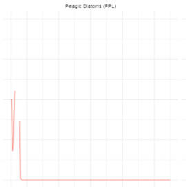
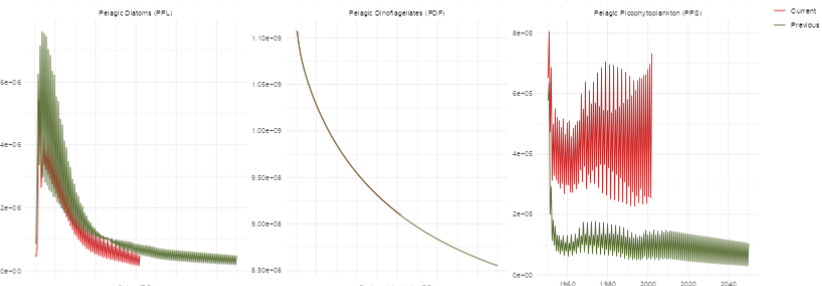

# EAAM Calibration notes
The original model has been modified in several ways:
- a box has been added (box id: 22) in the southern Kerguelen plateau in recognition of circulation patterns intensifying in that area, affecting nurseries of fish groups.
- ACCESS-OM2 model now provides flow and variables for physical configuration of the model, rather than ROMS.

# Calibration steps
- Model version: 29 boxes, ACCESS-OM2 physical configuration

### 29-01-2024: Model has been tested up to 10 yrs. 
Krill diet has been dialled down from a high percentage of ZM and ZG (copepods and salps, respectively) so that they are more reliant on primary producers. However, this leads to krill being unable to build enough reserves to ensure steady recruitment of larvae.
Change details:
- pPREY1KR1 and pPREY2KR1:

- pPREY1KR2, pPREY2KR2:

### 30-01-2024: Primary production, krill numbers and reserve weight
pPREY for krill predators (e.g., krill-eating seals and penguins, whales) has been increased to keep in check adult and juvenile numbers, which likely overgraze phytoplankton groups. KR age class 01 do not "explode" but remain between 1-1.5x of initial values. Adult numbers still shooting up to 10-12x, with reserve dropping as low reserve younger individuals are recruited into older classes.

### 31-01-2024: Primary production and simplified food web
Since krill is having trouble building reserves after removing ZM from their diet, I will try to avoid competition for diatom food supply (ZM main predator of PPL). I will redirect ZM towards PPS only, and get krill to be exclusive predator of PPL. Also, according to Pauli et al. 2021 "Selective feeding in Southern Ocean key grazers - diet composition of krill and salps", between 4-15% of krill diet is composed by copepods. I will add ZM back in KR diet gradually so that it doesn't become bulk of diet.
- What happened after these changes? KR still declining, ZG (salps) taking over PPL at the end of simulation.

Next steps:
- Check that C_KR and mum_KR are the same
- Reduce ZG competition
- Increase predation on KR to reduce adult numbers
- Decrease recruitment params in Beverton-Holt KR equation (EA_biol_newdiet_29_d_TEST_19_bev_kr.prm)

### 16-04-2024: Fixing primary production decline
Primary production is behaving oddly: in ReactiveAtlantis shiny app, the absolute and relative biomass of PPL and PPS (pelagic diatoms and pelagic picophytoplankton, respectively) experience a spike at the beginning, then decline. PPL keeps declining after 100 years of simulation, whilst PPS tends to stabilise around 0.5 of the original value. Multiple potential hypotheses:
1. nutrients are limited by lack of renewal/stagnant fluxes (physical environ);
2. competition between groups not balanced (ecological issues);
3. nutrient-related parameters are too “demanding” of available nutrients (ecological interaction with physical environ).

In Olive: MicroNut values seem to be relatively stable at first, cycling seasonally, but then start declining at around 1/4 of the run duration (25 years into the run). In contrast, NO3 and NH2 generally increase over time. Here, primary producer groups both appear to be struggling and do not show any initial spikes.

What I tried: I wrote a function that allows me to try a suite of different combinations of values, modified by percentage ranges. I changed values for N and MicroNut requirements for PP growth over a range from -50% to +50% over 25% intervals (separately).
- Changes to KN did not have impact on the output. 

### 17-04-2024: Primary production limitation issues
The "basic" equation for primary producer growth shows that light and nutrient limitations control PP fluxes:
$$\[
G_{pp} = mum * B_{PP} * \delta_{light} * \delta_{nutrient} ...
\]$$ 
ReactiveAtlantis's pp.growth() function suggests that, under the current parametrisation that was optimised for the ROMS physical configuration, primary producers are not in fact limited by nutrients, but by light.
$\delta$nutrient (scalar for nutrient limitation) is close to 1 for almost all boxes at surface layers, meaning that limiting nutrient is not the issue here. 
$\delta$light (scalar for light limitation) is often very low for surface layers - light is being blocked/is not enough for PP growth. 

A parameter that is often influential for competition for light and/or nutrient is mortality; in Atlantis, PP mortality is directly controlled through either linear mortality (mL) or lysis (KLYS). The "essential" equation is as follows:
$$\[
M_{pp} = \left( \frac{KLYS \times B_{pp}}{\delta_{nutrient} + 0.1} \right) + (mL \times B_{pp})
\]$$
KLYS is inversely related to $\delta$nutrient. Therefore if $\delta$nutrient is high or close to 1 (maximum value, PP is not limited by nutrient availability), KLYS will be particularly powerful. In this instance, increasing KLYS might be too destabilising as $\delta$nutrient is generally high. Increasing mL instead might represent a more cautious approach. 

What happens if mL is changed from its original value (0.14)?
- PPL_mL 0.02: PPL biomass drops off immediately
- PPL_mL 0.15: PPL biomass spikes then declines, PPS settles at 0.5 of original values 
- PPL_mL 0.16: PPL biomass spikes then declines to 0 after 25 years. PPS mirrors its trend, spiking once PPL declines
- Higher PPL_mL values only cause boom-and-bust of PPL biomass to occur earlier.

After setting PPL_mL to 0.15, I need to improve behaviour of model when biomass is high (as KLYS is inv. related to biomass). High biomass can be controlled through lysis, but too high KLYS means that another PP group will likely have the upper hand and spiral out of control. I set PPL_KLYS to 0.005 (was 0.001) as an exploratory step. --> PPL_KLYS 0.005 and PPL_mL 0.15 led to a spike of PPL biomass followed by immediate extinction of the functional group. 

### 18-04-2024: Primary production limitation issues
Both nutrient and light limitation occur in surface layers (at least in coastal boxes). 
KLYS and mL are supposed to facilitate the "cycling" of different groups (e.g., balance out competition between groups by eliminating one group at a faster rate than the other). However, the initial spike of PPL might be due to the group being too quick to grow - i.e., mum_PPL_T15 might be parameter responsible for PPL consuming nutrients too quickly. Even when PPL biomass then declines, the nutrients are presumably "locked away" in the detritus groups for a long time, requiring time to return to surface layers where light is plentiful. Even if BPP (primary producer biomass) still existed at minimal levels, it might not be enough to jumpstart the group once again.

As a first exploratory step, I decreased the growth parameter for PPL (mum_PPL_T15) by 20%, going from the original value of 0.42035 to 0.33628. --> outcome: PPL crashed at beginning of run, no spike.
I tried decreasing mum_PPL just by 10% (0.378315). --> slightly better outcome than 20% decrease in mum_PPL, but groups still goes extinct, whilst PPS increases.

Next step is to increase PPS_mL to tweak the balance between primary producers. 
I will increase PPS_mL from 0.14 to 0.15 as first step, as mL parameters seems to be very influential on PP groups. --> PPS biomass dips below 0.5 of initial values (close to 0.25), but an interesting pattern emerges: each year, the biomass spikes twice (instead of once).

I focused on mum_PPL_T15 again, this time decreasing it by 5% (from 0.42 to 0.39). --> PPS relative biomass is now around 1, slowly increasing as the initial spike of PPL decreases over time. This trend then amplifies over time, with PPS taking over.
mum_PPL_T15 0.41: better balance, although PPL still spikes (although not as much as original run) at the beginning.

Increasing KLYS_PPL to 0.003 caused PPL to spike, and PPL to drop to 0 at the beginning of the run. I changed KLYS_PPL to 0.0015; decreasing KLYS_PPL might be a way to prevent initial spike in PPL biomass?

### 19-04-2024: Primary production balancging
Methodical approach to balancig competition for resources between PPS and PPL - compile list of relevant parameters for growth and mortality of primary producer groups, and compare outcomes.
#### Relevant parameters:
- 